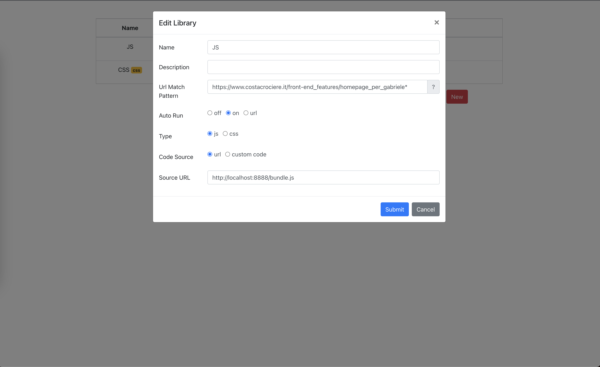
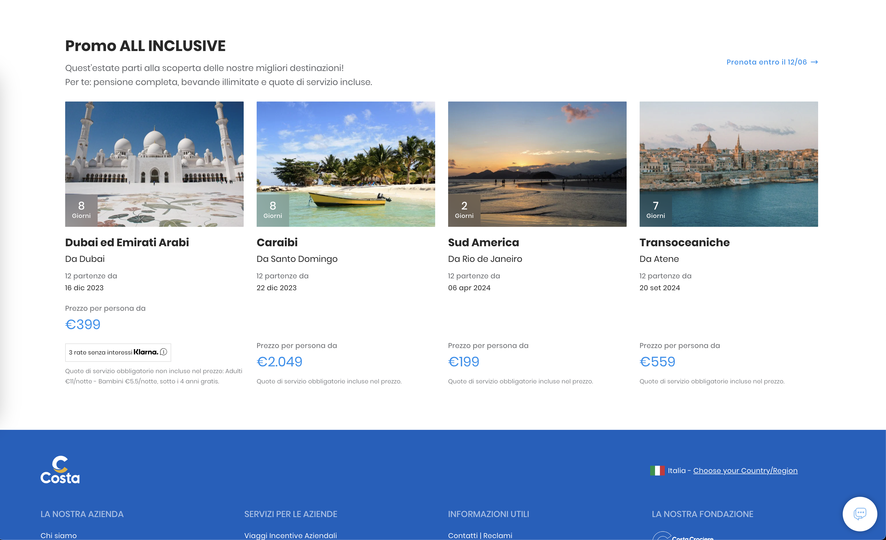

## Usage

1. Download an extension that allows injecting scripts and stylesheets into webpages. [Inject Code](https://chrome.google.com/webstore/detail/inject-code/jpbbdgndcngomphbmplabjginoihkdph) is a good choice if you are using Google Chrome.

2. Rename `.env.example` to `.env` and define the itineraries that you want to display under `CC_ITINERARY_IDS`.

3. Launch the development server with:

```sh
yarn start # production mode
yarn start:dev # development mode
```

The bundles will be available at http://localhost:8888/bundle.js and http://localhost:8888/bundle.css.

4. Load the bundles on https://costacrociere.it using the previously installed extension. With Inject Code:



5. Reload the Costa Crociere website to display new itineraries:




You can find a compiled version of the plugin in the branch `build`. The raw bundles are available here:
- [JS bundle](https://raw.githubusercontent.com/gabrielecanepa/costa-collection/build/build/bundle.js)
- [CSS bundle](https://raw.githubusercontent.com/gabrielecanepa/costa-collection/build/build/bundle.css)
